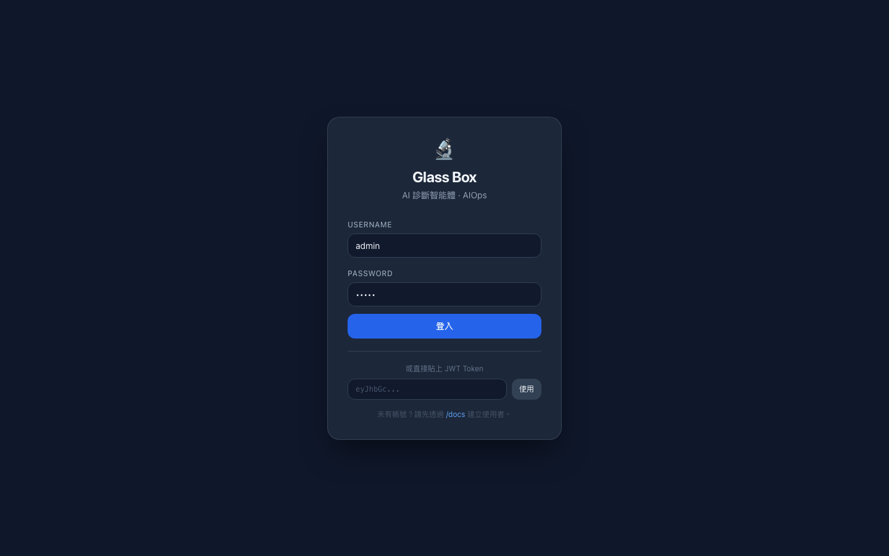
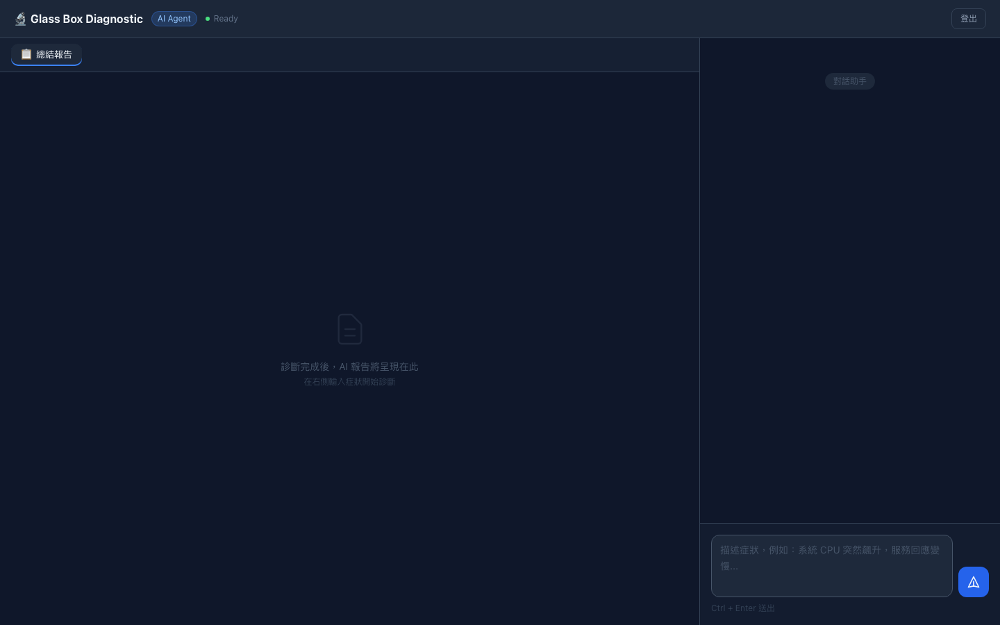
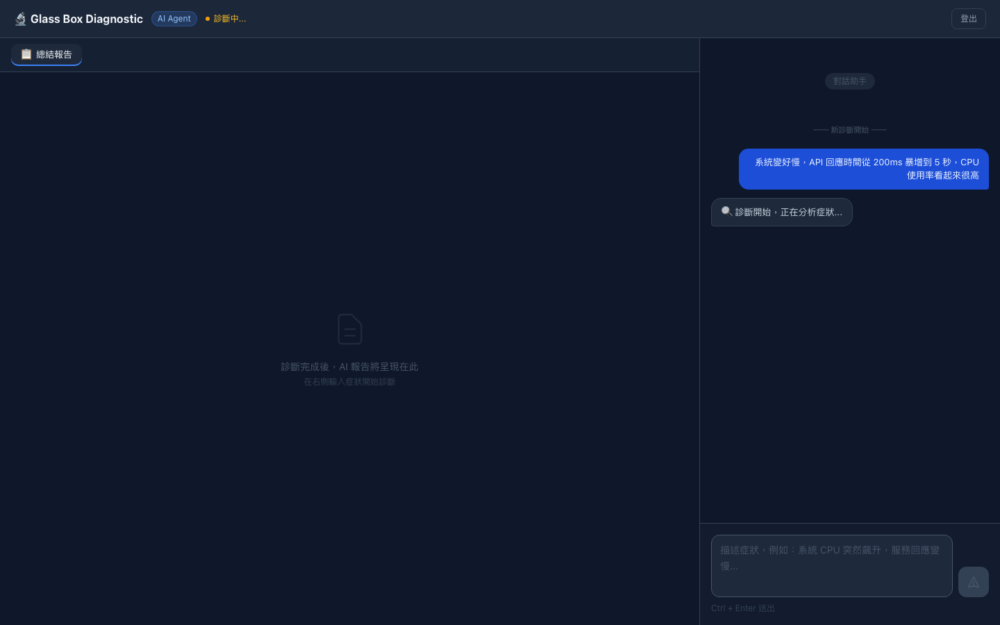
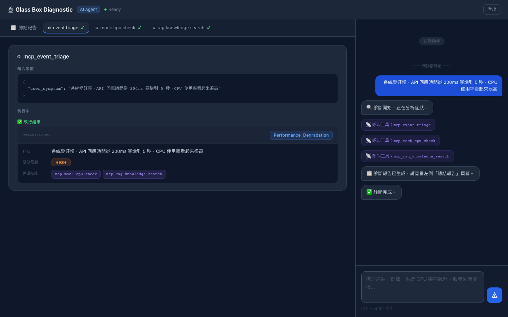
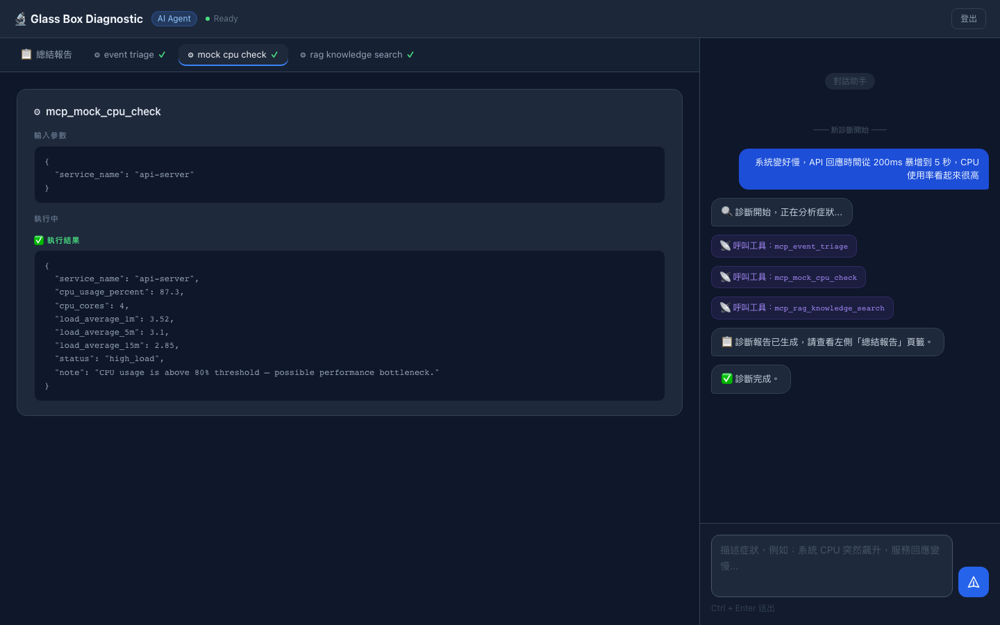
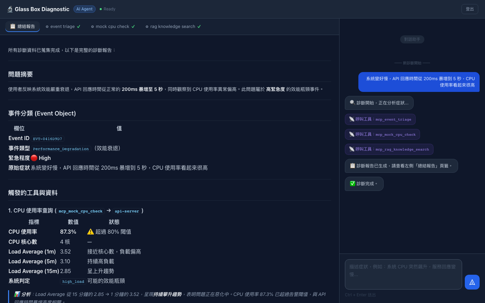

# Glass Box AI 診斷引擎 — 介紹文件與測試案例說明

> 版本：1.1.0　｜　最後更新：2026-02-28

---

## 一、系統概覽

**Glass Box AI 診斷引擎** 是一個以 FastAPI 為骨幹、整合 Anthropic Claude LLM 的智慧型問題診斷平台。

名稱「Glass Box（玻璃盒）」強調系統的核心設計理念：**AI 代理的每一個思考步驟、工具呼叫與資料來源，都即時透明地呈現在使用者面前**，完全相反於傳統的「Black Box（黑盒）」AI。

```
傳統黑盒 AI              Glass Box AI
┌──────────────┐         ┌──────────────────────────────────────┐
│              │         │  Step 1: mcp_event_triage            │
│   問題輸入    │         │    ✓ Performance_Degradation / HIGH  │
│      ↓       │         │                                      │
│   ???????????│         │  Step 2: mcp_mock_cpu_check          │
│   (不透明)   │         │    ✓ CPU: 87.3% — high_load          │
│      ↓       │         │                                      │
│   答案輸出   │         │  Step 3: mcp_rag_knowledge_search    │
│              │         │    ✓ SOP-001: CPU 高使用率排障 SOP    │
└──────────────┘         │                                      │
                         │  Final: 📋 Markdown 診斷報告          │
                         └──────────────────────────────────────┘
```

---

## 二、系統架構

```
┌─────────────────────────────────────────────────────────────┐
│                 Glass Box 前端 (Browser)                     │
│  ┌─────────────────────┐  ┌────────────────────────────┐    │
│  │  Left: Tool Tabs     │  │  Right: Chat / SSE Stream  │    │
│  │  [Summary][CPU][RAG] │  │  📡 即時事件訊息流          │    │
│  └─────────────────────┘  └────────────────────────────┘    │
└──────────────────────────────┬──────────────────────────────┘
                               │ SSE Stream (JWT Bearer)
                               │ POST /api/v1/diagnose/
┌──────────────────────────────▼──────────────────────────────┐
│                   FastAPI Backend                            │
│  ┌─────────────┐  ┌────────────────┐  ┌───────────────────┐ │
│  │  Router     │→ │  Diagnostic    │→ │  Anthropic Claude │ │
│  │  /diagnose  │  │  Service       │  │  claude-opus-4-6  │ │
│  └─────────────┘  └───────┬────────┘  └───────────────────┘ │
│                           │ Tool Calls                       │
│              ┌────────────▼────────────────────────┐        │
│              │          SKILL_REGISTRY              │        │
│              │  mcp_event_triage                    │        │
│              │  mcp_mock_cpu_check                  │        │
│              │  mcp_rag_knowledge_search            │        │
│              │  ask_user_recent_changes             │        │
│              └─────────────────────────────────────┘        │
└─────────────────────────────────────────────────────────────┘
```

---

## 三、核心設計原則

| 原則 | 實現方式 |
|------|---------|
| **透明性 (Glass Box)** | 每個工具呼叫即時透過 SSE 推送至前端，無任何延遲或隱藏 |
| **領域無關 (Domain-Agnostic)** | 路由決策完全委託給 LLM，不硬編碼任何業務邏輯 |
| **唯讀安全 (Read-Only)** | 所有 Skill 嚴格執行唯讀操作，AI 不能自動修復或重啟服務 |
| **強制分流 (Triage-First)** | System Prompt 強制 LLM 第一步必須呼叫 `mcp_event_triage` |
| **可擴充 (Extensible MCP)** | 新增 Skill 只需兩步驟：新增類別 + 加入 SKILL_REGISTRY |

---

## 四、系統畫面展示

### 4.1 登入畫面

開啟 `http://localhost:8000/` 即可看到登入介面，支援帳號密碼登入，也可直接貼上 JWT Token。



**說明**：
- 深色主題介面，預設填入測試帳號 `admin`
- 底部提供直接貼入 JWT Token 的快速入口
- 點擊「登入」後透過 `POST /api/v1/auth/login` 取得 Bearer Token

---

### 4.2 主介面（登入後）

登入成功後進入雙欄式主介面：左側 70% 為診斷工作區，右側 30% 為即時對話區。



**說明**：
- 頂部狀態列顯示 `AI Agent` 標籤與連線狀態（Ready / 診斷中...）
- 左側初始只有「總結報告」頁籤
- 右側輸入框支援 Ctrl+Enter 快速送出
- 底部提示文字引導使用者輸入症狀

---

### 4.3 診斷進行中

輸入問題後點擊送出，AI 開始執行診斷，右側即時顯示進度：



**說明**：
- 右側對話區即時推播每個步驟（診斷開始 → 呼叫工具...）
- 狀態列切換為「診斷中...」橘色狀態
- 送出按鈕暫時停用，防止重複提交

---

### 4.4 Event Object 卡片（mcp_event_triage 結果）

AI 呼叫 `mcp_event_triage` 後，結果以結構化卡片渲染在左側頁籤：



**說明**：
- 頁籤列顯示所有已呼叫的工具（`event triage ✓`、`mock cpu check ✓`、`rag knowledge search ✓`）
- 上半部：工具輸入參數（JSON 格式，深色背景）
- 下半部：結構化 Event Object 卡片，包含：
  - 事件 ID（`EVT-0416D9D7`）
  - 事件類型（`Performance_Degradation`，藍色標籤）
  - 症狀描述
  - 緊急程度（`HIGH`，橘色標籤）
  - 建議工具（`mcp_mock_cpu_check`、`mcp_rag_knowledge_search`，紫色標籤）
- 右側對話區顯示完整的工具呼叫歷程

---

### 4.5 CPU 查詢結果頁籤

點擊 `mock cpu check` 頁籤，查看 CPU 指標原始資料：



**說明**：
- 上半部：工具輸入（`service_name: "api-server"`）
- 下半部：工具執行結果（JSON 格式），包含：
  - `cpu_usage_percent: 87.3`（超過 80% 閾值）
  - `load_average` 1m/5m/15m 均高
  - `status: "high_load"`
  - 警告訊息：CPU usage is above 80% threshold

---

### 4.6 最終診斷報告

點擊「總結報告」頁籤，查看 AI 生成的完整 Markdown 診斷報告：



**說明**：
- 報告包含五個標準章節：問題摘要、事件分類、觸發的工具與資料、可能原因分析、建議處置
- 表格形式呈現 CPU 指標，含閾值警告標示
- 右側對話區顯示「✅ 診斷完成」確認訊息

---

## 五、SSE 事件流說明

前端與後端之間透過 **Server-Sent Events (SSE)** 進行即時通訊。每個 SSE 事件遵循以下格式：

```
event: <event_type>
data: <JSON 字串>

```

### 事件類型一覽

| 事件類型 | 觸發時機 | Payload 欄位 |
|----------|----------|-------------|
| `session_start` | 每次診斷開始時發送一次 | `issue` |
| `tool_call` | 每次 AI 呼叫工具前 | `tool_name`, `tool_input` |
| `tool_result` | 每次工具執行完成後 | `tool_name`, `tool_result`, `is_error` |
| `report` | AI 完成最終診斷報告時 | `content` (Markdown), `total_turns`, `tools_invoked` |
| `error` | 出現未處理的例外時 | `message` |
| `done` | 每次診斷結束（無論成功/失敗）一定發送 | `status: "complete"` |

### 完整事件流範例（效能問題情境）

```
event: session_start
data: {"issue": "系統很慢，API 很卡，CPU 可能過高"}

event: tool_call
data: {"tool_name": "mcp_event_triage", "tool_input": {"user_symptom": "系統很慢，..."}}

event: tool_result
data: {"tool_name": "mcp_event_triage", "tool_result": {
         "event_id": "EVT-A1B2C3D4",
         "event_type": "Performance_Degradation",
         "attributes": {"symptom": "...", "urgency": "high"},
         "recommended_skills": ["mcp_mock_cpu_check", "mcp_rag_knowledge_search"]
       }, "is_error": false}

event: tool_call
data: {"tool_name": "mcp_mock_cpu_check", "tool_input": {"service_name": "api-server"}}

event: tool_result
data: {"tool_name": "mcp_mock_cpu_check", "tool_result": {
         "cpu_usage_percent": 87.3, "status": "high_load", ...
       }, "is_error": false}

event: tool_call
data: {"tool_name": "mcp_rag_knowledge_search", "tool_input": {"query": "CPU 高使用率"}}

event: tool_result
data: {"tool_name": "mcp_rag_knowledge_search", "tool_result": {...}, "is_error": false}

event: report
data: {"content": "## 問題摘要\n...", "total_turns": 4, "tools_invoked": [...]}

event: done
data: {"status": "complete"}
```

---

## 六、測試案例說明

### 測試案例總覽

系統共包含 **83 個自動化測試**，分布於 5 個測試檔案：

```
tests/
├── conftest.py               → Fixtures 定義（測試 DB、HTTP Client、JWT）
├── test_auth.py              → 7  個測試（身份驗證）
├── test_users.py             → 13 個測試（使用者 CRUD）
├── test_items.py             → 15 個測試（物品 CRUD）
├── test_diagnostic_flow.py   → 28 個測試（診斷代理核心）
└── test_combined_flow.py     → 20 個測試（整合測試）
                              ─────────────
                              83 個測試（全部通過 ✓）
```

> **重要**：所有測試使用 mock Anthropic 客戶端，**不需要真實 API Key** 即可執行。

---

### 測試案例 TC-01：身份驗證 (test_auth.py)

**目標**：驗證 JWT 身份驗證機制的完整流程。

| 測試項目 | 說明 | 預期結果 |
|----------|------|---------|
| `test_login_success` | 正確帳密登入 | 回傳 JWT Token |
| `test_login_wrong_password` | 密碼錯誤 | HTTP 401 |
| `test_login_user_not_found` | 帳號不存在 | HTTP 401 |
| `test_get_me_authenticated` | 帶 Token 查詢當前使用者 | 回傳使用者資訊 |
| `test_get_me_unauthenticated` | 不帶 Token 查詢 | HTTP 401 |
| `test_get_me_invalid_token` | 無效 Token | HTTP 401 |
| `test_token_expiry` | 過期 Token | HTTP 401 |

**執行方式**：

```bash
pytest tests/test_auth.py -v
```

---

### 測試案例 TC-02：使用者管理 (test_users.py)

**目標**：驗證使用者建立、查詢、更新、刪除及權限控管。

| 測試項目 | 說明 | 預期結果 |
|----------|------|---------|
| `test_create_user_success` | 建立新使用者 | HTTP 201 |
| `test_create_user_duplicate` | 重複帳號 | HTTP 400 |
| `test_get_users_list` | 取得使用者列表 | 分頁資料 |
| `test_get_user_by_id` | 查詢指定使用者 | 使用者資訊 |
| `test_update_user_self` | 更新自己的資料 | HTTP 200 |
| `test_update_user_other` | 嘗試更新他人資料 | HTTP 403 |
| `test_delete_user_self` | 刪除自己的帳號 | HTTP 200 |
| `test_delete_user_other` | 嘗試刪除他人帳號 | HTTP 403 |
| ...（共 13 項） | | |

---

### 測試案例 TC-03：物品管理 (test_items.py)

**目標**：驗證物品 CRUD 操作及所有權驗證邏輯。

| 測試項目 | 說明 | 預期結果 |
|----------|------|---------|
| `test_create_item_authenticated` | 認證使用者建立物品 | HTTP 201 |
| `test_create_item_unauthenticated` | 未認證建立物品 | HTTP 401 |
| `test_get_items_list` | 取得所有物品（分頁） | 列表資料 |
| `test_get_my_items` | 取得自己的物品 | 過濾後的列表 |
| `test_update_item_owner` | 物品擁有者更新 | HTTP 200 |
| `test_update_item_non_owner` | 非擁有者嘗試更新 | HTTP 403 |
| `test_delete_item_owner` | 物品擁有者刪除 | HTTP 200 |
| ...（共 15 項） | | |

---

### 測試案例 TC-04：診斷代理核心 (test_diagnostic_flow.py)

**目標**：驗證 MCP Skill 合約、Agent Loop 邏輯，以及 SSE 串流 HTTP 端點。

#### TC-04-A：Skill 合約驗證（8 項）

| 測試項目 | 說明 |
|----------|------|
| `test_skill_registry_contains_all` | SKILL_REGISTRY 包含所有已定義 Skill |
| `test_event_triage_classifies_performance` | 關鍵字 "慢" → `Performance_Degradation` |
| `test_event_triage_classifies_service_down` | 關鍵字 "掛了" → `Service_Down` |
| `test_event_triage_unknown_symptom` | 未匹配關鍵字 → `Unknown_Symptom` |
| `test_cpu_check_returns_required_fields` | CPU 查詢回傳必要欄位 |
| `test_rag_search_returns_results` | RAG 搜尋回傳文件 |
| `test_ask_user_returns_structured` | ask_user 回傳結構化資料 |
| `test_skill_to_anthropic_tool_schema` | 工具 JSON Schema 格式正確 |

#### TC-04-B：Agent Loop 驗證（12 項）

```
Mock Anthropic Client 設定：
  Turn 1: stop_reason="tool_use" → 呼叫 mcp_event_triage
  Turn 2: stop_reason="tool_use" → 呼叫 mcp_mock_cpu_check
  Turn 3: stop_reason="end_turn" → 輸出最終報告
```

| 測試項目 | 說明 |
|----------|------|
| `test_run_basic_flow` | 完整三輪對話流程 |
| `test_run_returns_diagnose_response` | 回傳 `DiagnoseResponse` 型別 |
| `test_run_tools_invoked_list` | `tools_invoked` 包含正確的工具記錄 |
| `test_run_max_turns_reached` | 超過最大迴圈 → 強制輸出報告 |
| `test_run_unknown_tool` | LLM 呼叫不存在工具 → 優雅處理錯誤 |
| `test_stream_emits_session_start` | 串流第一個事件為 `session_start` |
| `test_stream_emits_tool_call_events` | 每次工具呼叫前發送 `tool_call` 事件 |
| `test_stream_emits_tool_result_events` | 每次工具完成後發送 `tool_result` 事件 |
| `test_stream_emits_report` | 最終發送 `report` 事件 |
| `test_stream_always_emits_done` | 無論成功/失敗，最後一定發送 `done` |
| `test_stream_emits_error_on_exception` | 例外時發送 `error` 事件 |
| `test_serialize_content_strips_extra_fields` | `_serialize_content` 正確去除 SDK 額外欄位 |

#### TC-04-C：HTTP 端點驗證（8 項）

| 測試項目 | 說明 |
|----------|------|
| `test_diagnose_endpoint_requires_auth` | 未帶 Token → HTTP 401 |
| `test_diagnose_endpoint_with_valid_token` | 帶有效 Token → HTTP 200 SSE |
| `test_diagnose_sse_content_type` | 回應 Content-Type: text/event-stream |
| `test_diagnose_empty_issue` | 空字串輸入 → HTTP 422 |
| `test_diagnose_missing_body` | 缺少 body → HTTP 422 |
| `test_diagnose_long_issue` | 長字串輸入 → 正常處理 |
| `test_diagnose_response_contains_session_start` | SSE 回應包含 session_start 事件 |
| `test_diagnose_response_contains_done` | SSE 回應包含 done 事件 |

---

### 測試案例 TC-05：整合測試 (test_combined_flow.py)

**目標**：模擬完整的端對端場景，含使用者建立 → 登入 → 診斷 → 驗證 SSE 事件序列。

| 測試項目 | 說明 |
|----------|------|
| `test_full_flow_performance_issue` | 效能問題完整診斷流程 |
| `test_full_flow_service_down` | 服務中斷完整流程 |
| `test_full_flow_memory_leak` | 記憶體洩漏完整流程 |
| `test_full_flow_unknown_symptom` | 未知症狀 → Unknown_Symptom 分類 |
| `test_sse_event_ordering` | 驗證 SSE 事件順序：session_start → tool_call → tool_result → report → done |
| `test_triage_always_first_tool` | `mcp_event_triage` 永遠是第一個工具 |
| `test_event_object_schema_in_stream` | SSE tool_result 包含正確的 Event Object 結構 |
| `test_recommended_skills_followed` | AI 遵循 `recommended_skills` 清單呼叫工具 |
| `test_concurrent_diagnosis` | 並行多個診斷請求（隔離性驗證） |
| `test_auth_required_for_sse_stream` | SSE 端點必須帶 JWT Token |
| ...（共 20 項） | | |

---

## 七、典型診斷情境測試

### 情境 1：效能問題（Performance_Degradation）

**輸入問題**：
```
系統變好慢，API 回應時間從 200ms 暴增到 5 秒，CPU 使用率看起來很高
```

**預期 Agent 執行流程**：

```
Turn 1: LLM → 呼叫 mcp_event_triage
        └─ 輸出: event_type=Performance_Degradation, urgency=high
                 recommended_skills: [mcp_mock_cpu_check, mcp_rag_knowledge_search]

Turn 2: LLM → 呼叫 mcp_mock_cpu_check
        └─ 輸出: cpu_usage_percent=87.3, status=high_load

Turn 3: LLM → 呼叫 mcp_rag_knowledge_search
        └─ 輸出: [SOP-001: CPU 高使用率排障 SOP]

Turn 4: LLM → 輸出最終診斷報告 (stop_reason=end_turn)
```

實際執行結果（截圖）：


*Event Object 卡片顯示事件類型 `Performance_Degradation`，緊急程度 `HIGH`，建議工具標籤清晰可見*


*CPU 使用率 87.3%，`high_load` 狀態，Load Average 持續偏高*


*AI 生成的完整 Markdown 報告，包含問題摘要、事件分類表格、觸發工具資料與建議處置*

---

### 情境 2：服務中斷（Service_Down）

**輸入問題**：
```
服務突然掛了，前端顯示 503 Service Unavailable，連不上後端 API
```

**預期 Agent 執行流程**：

```
Turn 1: LLM → 呼叫 mcp_event_triage
        └─ 輸出: event_type=Service_Down, urgency=critical
                 recommended_skills: [mcp_rag_knowledge_search, ask_user_recent_changes]

Turn 2: LLM → 呼叫 mcp_rag_knowledge_search
        └─ 搜尋服務中斷 SOP

Turn 3: LLM → 呼叫 ask_user_recent_changes
        └─ 詢問最近是否有部署或設定變更

Turn 4: LLM → 輸出最終診斷報告
```

緊急程度為 `CRITICAL`（紅色標籤），AI 會詢問近期操作記錄。

---

### 情境 3：資訊不足（Unknown_Symptom）

**輸入問題**：
```
系統出問題了，請幫我看看
```

**預期 Agent 執行流程**：

```
Turn 1: LLM → 呼叫 mcp_event_triage
        └─ 輸出: event_type=Unknown_Symptom, urgency=low
                 recommended_skills: [mcp_rag_knowledge_search]

Turn 2: LLM → 呼叫 mcp_rag_knowledge_search（一般性搜尋）

Turn 3: LLM → 輸出報告，請使用者提供更多具體症狀
```

LLM 自主判斷資訊不足，報告中會主動請使用者補充更多細節。

---

## 八、執行所有測試

```bash
cd fastapi_backend_service

# 執行全部測試
pytest -v

# 執行含覆蓋率報告
pytest --cov=app --cov-report=term-missing

# 只執行診斷相關測試
pytest tests/test_diagnostic_flow.py tests/test_combined_flow.py -v
```

**預期結果**：

```
============================= test session starts ==============================
platform darwin -- Python 3.10+
collected 83 items

tests/test_auth.py::test_login_success PASSED
...
tests/test_diagnostic_flow.py::test_stream_always_emits_done PASSED
tests/test_combined_flow.py::test_full_flow_performance_issue PASSED
...
============================== 83 passed in X.Xs ===============================
```

---

## 九、將本文件轉換為 PDF

**方法 A：使用 VS Code**

安裝 `Markdown PDF` 擴充套件後，按 `Ctrl+Shift+P` → `Markdown PDF: Export (pdf)`

**方法 B：使用 Pandoc（推薦）**

```bash
brew install pandoc
pandoc docs/introduction_testcase.md \
  -o docs/introduction_testcase.pdf \
  --pdf-engine=weasyprint \
  --toc
```

**方法 C：使用瀏覽器列印**

用 Markdown 預覽工具（如 `grip`）渲染後，在瀏覽器按 `Ctrl+P` → 另存為 PDF。

---

*Glass Box AI 診斷引擎 — 介紹文件 v1.1.0*
*Anthropic Claude claude-opus-4-6 · FastAPI · Server-Sent Events*
*截圖拍攝於 2026-02-28，系統版本 v3.5*
